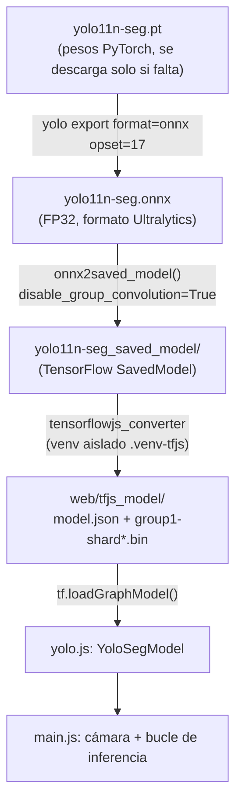

# YOLO11-seg en el navegador (TensorFlow.js + WebGPU)

Segmentación de instancias en tiempo real usando la cámara del dispositivo, pensada para
abrirse principalmente desde un **móvil**. Corre 100% en el cliente (no hay backend de
inferencia): carga un grafo de **TensorFlow.js** con `@tensorflow/tfjs`, probando primero
el backend **WebGPU** (GPU real vía la API WebGPU del navegador) y haciendo *fallback*
automático a **WASM** y luego **CPU** si no está disponible.

## Estructura

```
web/
├── index.html          # UI (vídeo + canvas overlay + controles)
├── style.css
├── main.js             # cámara, bucle de inferencia, dibujado
├── yolo.js              # carga del modelo, preprocesado, decodificación, NMS, máscaras
├── coco-classes.js     # nombres de clases COCO y colores
├── tfjs_model/           # grafo TF.js convertido (model.json + group1-shard*.bin)
├── server.js            # servidor HTTPS estático para pruebas (necesario en móvil)
└── certs/               # certificado autofirmado usado por server.js
```

## Flujo completo: del `.pt` a la app



1. **`yolo11n-seg.pt`**: pesos originales de Ultralytics.
2. **Export a ONNX**: `yolo export model=yolo11n-seg.pt format=onnx opset=17` → `yolo11n-seg.onnx` (FP32). Ya no lo usa la app en producción; era el punto de partida del intento previo con `onnxruntime-web` (ver [Historial](#historial-por-qué-tensorflowjs-y-no-onnxruntime-web)).
3. **ONNX → SavedModel**, llamando directamente a la función interna de Ultralytics para poder pasar `disable_group_convolution=True` (necesario, ver más abajo):
   ```python
   from ultralytics.utils.export.tensorflow import onnx2saved_model
   onnx2saved_model("yolo11n-seg.onnx", "yolo11n-seg_saved_model",
                     disable_group_convolution=True, cuda=False)
   ```
4. **SavedModel → TF.js**, en un **venv aislado** (`.venv-tfjs`) para evitar el conflicto de `protobuf` entre `onnx`/`tensorflow`/`tensorflow_decision_forests`:
   ```bash
   python3 -m venv .venv-tfjs && source .venv-tfjs/bin/activate
   pip install tensorflowjs
   tensorflowjs_converter --input_format=tf_saved_model \
     --output_format=tfjs_graph_model --signature_name=serving_default \
     yolo11n-seg_saved_model web/tfjs_model
   ```
5. **Carga en el navegador**: `yolo.js` lee `web/tfjs_model/model.json`, extrae los
   nombres reales de los tensores de salida (ver nota más abajo) y llama a
   `tf.loadGraphModel()` probando backend `webgpu → wasm → cpu`.
6. **Inferencia por frame**: `main.js` captura el frame de cámara; `yolo.js` hace el
   letterbox + `tf.browser.fromPixels`, ejecuta `model.execute(...)`, decodifica
   cajas/clases/máscaras y dibuja sobre el `<canvas>`.

> Si vuelves a entrenar o reexportar el `.pt`, hay que repetir los pasos 2-4 a mano (no
> existe un único comando `yolo export format=tfjs` en esta versión de Ultralytics).

## Cómo funciona la inferencia

- **Entrada**: `images` `[1,640,640,3]` float32 **NHWC** (TF.js construye el tensor
  directamente desde el canvas con `tf.browser.fromPixels`, sin empaquetado manual).
- **Salidas** (mismo contenido que en el export ONNX original de Ultralytics):
  - `output_0` → `[1,116,8400]`: 4 coords de caja + 80 puntuaciones de clase + 32
    coeficientes de máscara, por cada una de las 8400 celdas.
  - `output_1` → `[1,160,160,32]` (NHWC, prototipos de máscara — nótese que en ONNX era
    `[1,32,160,160]` CHW; el índice de acceso en `yolo.js` está adaptado a NHWC).
- **Postprocesado** (`yolo.js`): filtro por confianza, NMS por clase, y por cada
  detección se reconstruye la máscara combinando los coeficientes con los prototipos
  (sigmoide + umbral).
- **Dibujado**: cajas, etiqueta+score y máscara semitransparente sobre un `<canvas>`
  superpuesto al `<video>` (mismo tamaño y `object-fit` para que coincidan píxel a píxel).

### Nombres de tensor de salida: no fiarse del orden del array

`tf.GraphModel.execute()` puede devolver los tensores en un orden que **no** coincide con
`output_0`/`output_1` tal como aparecen en la firma (`signature.outputs`) — en este modelo,
`output_1` aparece antes que `output_0` en el propio `model.json`. Por eso `yolo.js` lee
los nombres reales (`Identity:0` / `Identity_1:0`) del `model.json` al cargar y los pide
explícitamente: `model.execute(inputs, [nombreOutput0, nombreOutput1])`.

### HUD de depuración

Junto al estado y los FPS se muestra `mejor: <clase> <%> · persona: <%>`: la puntuación
más alta detectada en el frame (de cualquier clase) y la puntuación máxima para la clase
"person", **aunque estén por debajo del umbral de confianza**. Útil para saber si hay que
bajar el slider de confianza o si el modelo realmente no ve nada.

## Uso

### 1. Servir por HTTPS

`getUserMedia` exige un contexto seguro. En `localhost` basta con HTTP, pero para abrir
la app **desde el móvil** (misma red WiFi) hace falta HTTPS, por eso se incluye un
servidor mínimo con certificado autofirmado:

```bash
cd web
node server.js
```

Salida esperada:

```
Servidor HTTPS escuchando en el puerto 8443
  https://<ip-de-tu-equipo>:8443   ← ábrelo desde el móvil (misma WiFi)
  https://localhost:8443           ← para probar en este equipo
```

El navegador avisará de certificado no confiable (es autofirmado): acepta el riesgo para
continuar. Si haces cambios en el código, sube el número de versión (`?v=N`) en los
`<script>` de `index.html`, ya que el servidor no cachea pero el navegador puede hacerlo
igualmente.

### 2. Usar la app

1. Pulsa **"Iniciar cámara"** y concede el permiso.
2. Ajusta el slider **"Confianza"** si no ves detecciones (bájalo a ~0.15–0.25).
3. **"Cambiar cámara"** alterna entre trasera/frontal.

## GPU en el navegador: qué garantiza (y qué no) TF.js

- **WebGPU es el "delegate" de GPU real**: los kernels corren sobre la GPU del sistema a
  través de la API WebGPU del navegador. El backend WebGPU de TF.js lleva más tiempo
  madurando que el de `onnxruntime-web` y tiene mejor cobertura de operadores para este
  tipo de grafos (ver [Historial](#historial-por-qué-tensorflowjs-y-no-onnxruntime-web)).
- **No se puede "forzar" GPU de forma universal en todos los móviles**: WebGPU depende
  del navegador y del dispositivo (bien soportado en Chrome/Edge Android recientes, más
  limitado en Safari/iOS, experimental en Firefox). Cuando no está disponible, la app cae
  a **WASM** y por último a **CPU** (JS puro) — el único camino garantizado en cualquier
  navegador.
- El HUD muestra siempre el backend real en uso: `Detectando (webgpu)`, `(wasm)` o `(cpu)`.
- GitHub Pages no permite fijar cabeceras `Cross-Origin-Opener-Policy`/
  `Cross-Origin-Embedder-Policy`, así que en ese despliegue el WASM de TF.js no puede usar
  `SharedArrayBuffer` (sigue funcionando, solo que sin multi-hilo). WebGPU no se ve
  afectado por esto.

## Despliegue automático (GitHub Pages)

El workflow [.github/workflows/deploy-pages.yml](.github/workflows/deploy-pages.yml)
publica el contenido de `web/` (excepto `certs/` y `server.js`, que sólo hacen falta para
HTTPS local) en GitHub Pages en cada push a `main` que toque esa carpeta.

Pasos de configuración (una sola vez, en el repositorio de GitHub):
1. **Settings → Pages → Build and deployment → Source**: elegir **"GitHub Actions"**
   (no "Deploy from a branch").
2. Hacer push a `main` — el workflow se ejecuta solo y publica la web en
   `https://<usuario>.github.io/<repo>/`.
3. También se puede lanzar a mano desde **Actions → Deploy web app to GitHub Pages →
   Run workflow**.

`web/tfjs_model/` se versiona en git porque GitHub Pages sólo publica archivos del
repositorio; si el modelo creciera mucho o cambiara a menudo, valdría la pena migrarlo a
[Git LFS](https://git-lfs.com/).

## ¿Hace falta el fichero `.pt`?

No, para la app web **no se usa en ningún momento** — solo lee `web/tfjs_model/`. El
`.pt` (pesos de PyTorch) sólo es necesario si quieres **volver a exportar** el modelo más
adelante (otro `opset`, `imgsz`, cuantización, etc.). Si no vas a tocar el modelo, puedes
borrarlo con seguridad; Ultralytics lo vuelve a descargar automáticamente si falta.

## Historial: por qué TensorFlow.js y no onnxruntime-web

La primera versión de esta app usaba `onnxruntime-web` con `model.onnx`. Se abandonó tras
dos bloqueos reales (no eran errores de configuración):

1. **Softmax fuera del último eje**: el módulo DFL de YOLO11 (`Reshape → Transpose →
   Softmax(axis=1) → Conv`) hace softmax sobre un eje intermedio de un tensor
   `[1,16,4,8400]`. El backend WebGPU (JSEP) de `onnxruntime-web` en la versión usada solo
   soporta softmax sobre el **último** eje. Se llegó a parchear el grafo ONNX insertando
   `Transpose`s (script ya retirado del repo) y funcionó, pero reveló
   que la cobertura de operadores de ese backend va muy por detrás de WASM.
2. **Convoluciones agrupadas (`groups>1`)**: al migrar a TensorFlow.js nos encontramos con
   un problema análogo pero en un motor distinto: `onnx2tf` convertía las convoluciones
   *depthwise* del bloque de atención y de la cabeza de clasificación de YOLO11 como
   `Conv2D` genérico con `groups>1`, algo que TF.js no soporta
   (`Error in conv2d: depth of input (128) must match input depth for filter 1`). Se
   resolvió pasando `disable_group_convolution=True` a `onnx2saved_model()`, que las
   descompone en operaciones equivalentes que TF.js sí soporta.

Conclusión práctica: **cualquier motor de inferencia en el navegador para una red YOLO
moderna (v8+) puede toparse con huecos de cobertura de operadores**, sobre todo en el
backend GPU. No es algo específico de este modelo ni de cómo se exportó — es el estado
actual de madurez de la inferencia ML en navegador. La app está preparada para degradar
con elegancia (fallback automático de backend) precisamente por eso.

